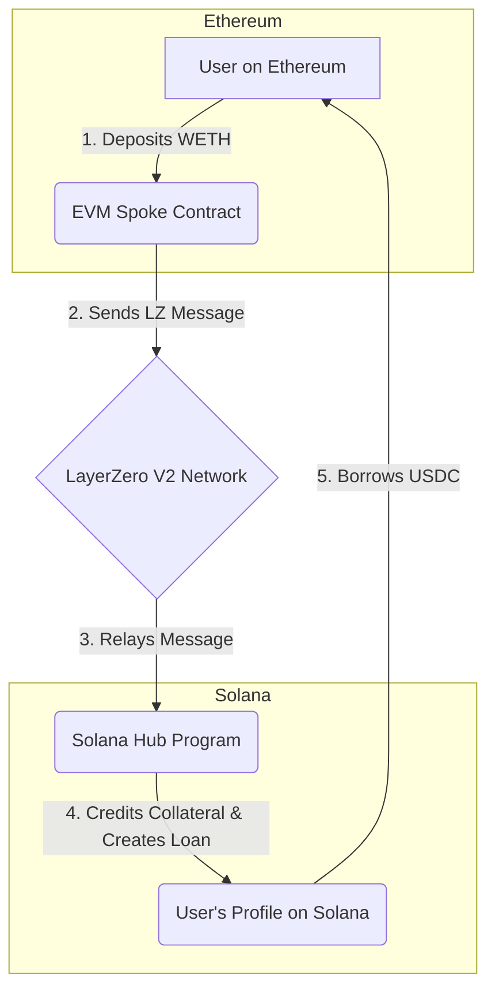

# Meridian Protocol

[](https://github.com/your-username/meridian-protocol)
[](https://opensource.org/licenses/MIT)
[](https://earn.superteam.fun/listing/layerzero-solana-breakout-track)

**Meridian Protocol is a trust-based, omnichain lending protocol built on LayerZero V2 and Solana.** It introduces on-chain identity as a core financial primitive, allowing users to leverage their reputation for tangible benefits like higher LTVs and better borrowing rates.

## The Problem

The current DeFi lending landscape is fragmented and impersonal.
1.  **Liquidity is Siloed:** Assets on one chain are useless on another without risky, high-friction bridging.
2.  **Lending is Impersonal:** A user with a perfect repayment history is treated identically to a brand-new, anonymous wallet. Good behavior is not rewarded.

## The Solution: Meridian Protocol

Meridian solves these problems by creating a single, global liquidity market underpinned by verifiable on-chain identity.

### Core Features

*   **Omni-Chain Identity (OCI):** Users mint a permanent, non-transferable NFT "passport" on Solana, which acts as the anchor for their identity.
*   **Trust Score:** Positive actions, such as timely loan repayments, increase a user's Trust Score. This score is a quantifiable measure of their on-chain reputation.
*   **Reputation-Based Lending:** A higher Trust Score directly translates to better borrowing terms (e.g., higher Loan-to-Value ratios).
*   **Seamless Cross-Chain Borrows:** Deposit collateral on an EVM chain (like Ethereum) and instantly borrow assets on Solana without ever manually bridging funds.

## How It Works: Hub-and-Spoke Architecture

Meridian uses Solana as a high-speed "Hub" for all state and business logic, and other chains (like Ethereum) as "Spokes" for collateral deposits. LayerZero's OApp standard acts as the secure messaging fabric connecting them.



## Tech Stack

*   **Hub (Solana):** Rust, Anchor Framework
*   **Spoke (EVM):** Solidity, Hardhat
*   **Interoperability:** LayerZero V2 OApp
*   **Identity:** Metaplex Token Standard (NFTs)
*   **Frontend:** Next.js, Ethers.js, @solana/web3.js

## Getting Started (Testnet Guide)

This guide will walk you through deploying and running the entire protocol on the **Solana Devnet** and **Sepolia Testnet**.

### Prerequisites

*   Node.js >= 18.0.0
*   Yarn
*   Rust & Cargo
*   Solana CLI >= 1.16.0
*   Anchor CLI >= 0.28.0
*   A Solana wallet (Phantom) with Devnet SOL.
*   An EVM wallet (MetaMask) with Sepolia ETH.

### 1. Setup & Configuration

First, clone the repository and install all dependencies.

```bash
git clone https://github.com/your-username/meridian-protocol.git
cd meridian-protocol

# Install root, EVM, and Solana dependencies
yarn install
```

Next, configure your environment variables. Create a `.env` file in the root of the project by copying the example:

```bash
cp .env.example .env
```

Now, edit the `.env` file with your own keys:
```env
# .env
SEPOLIA_RPC_URL="httpss://sepolia.infura.io/v3/YOUR_INFURA_API_KEY"
METAMASK_PRIVATE_KEY="YOUR_METAMASK_PRIVATE_KEY"
SOLANA_WALLET_PATH="/path/to/your/solana/wallet.json"
```

### 2. Full Deployment Workflow

This is a step-by-step process to deploy and connect the contracts.

#### **Step A: Deploy Solana Hub to Devnet**

```bash
# Navigate to the Solana directory
cd solana-hub

# Build the program
anchor build

# Get the new Program ID (you'll need this)
SOLANA_PROGRAM_ID=$(solana-keygen pubkey target/deploy/meridian_protocol-keypair.json)
echo "Your new Solana Program ID is: $SOLANA_PROGRAM_ID"

# Update `declare_id!` in programs/meridian_protocol/src/lib.rs with the new ID

# Re-build and deploy to Devnet
anchor build
anchor deploy
```

#### **Step B: Deploy EVM Spoke to Sepolia**

```bash
# Navigate to the EVM directory
cd ../evm-spoke

# Deploy the contract to Sepolia testnet
npx hardhat run scripts/deploy.ts --network sepolia

# Save the deployed contract address that is printed to the console.
```

#### **Step C: Initialize & Configure LayerZero**

Now we connect the two deployed contracts.

1.  **Initialize the Solana Hub:** Run a script (e.g., via `anchor test`) to call the `initialize` instruction on your Solana program. You must provide it with:
    *   `spoke_chain_id`: `10161` (LayerZero's EID for Sepolia)
    *   `spoke_contract`: The deployed EVM contract address from Step B.

2.  **Configure LayerZero Peers:** Update your `layerzero.config.ts` with your new Solana Program ID and EVM contract address. Then, run the CLI commands from the project root:

    ```bash
    # This authorizes the EVM contract to send messages to the Solana program
    npx lz-oapp-cli oapp set-peer --network sepolia MeridianSpokeOApp solana-devnet YOUR_SOLANA_PROGRAM_ID
    
    # This authorizes the Solana program to send messages back (for future use)
    npx lz-oapp-cli oapp set-peer --network solana-devnet MeridianHub sepolia YOUR_EVM_CONTRACT_ADDRESS
    ```

### 3. Running the Frontend

Once the backend is deployed and configured, you can run the frontend application.

```bash
# Navigate to the frontend directory
cd ../frontend

# Start the development server
yarn dev
```

Open `http://localhost:3000` in your browser to interact with the Meridian Protocol.

## Project Structure

```
.
├── evm-spoke/      # Hardhat project for the EVM collateral contract
├── frontend/       # Next.js frontend application
├── solana-hub/     # Anchor project for the Solana state & logic hub
└── layerzero.config.ts # Configuration for LayerZero OApp peers
```

## Future Roadmap

*   **Mainnet Hardening:** Integrate Pyth or Switchboard oracles, implement a multisig for governance, and add emergency pause functionality.
*   **Liquidation Engine:** Build off-chain bots to keep the protocol solvent.
*   **Expanded Collateral:** Add support for more assets (LSTs, stablecoins) via on-chain governance.
*   **VLP System:** Implement the Verifiable Liquidity Provider system for institutional pools.
*   **Formal Audits:** Undergo comprehensive security audits before mainnet launch.

## Contributing

Contributions are welcome! Please feel free to open an issue or submit a pull request.

## License

This project is licensed under the MIT License. See the [LICENSE](LICENSE) file for details.